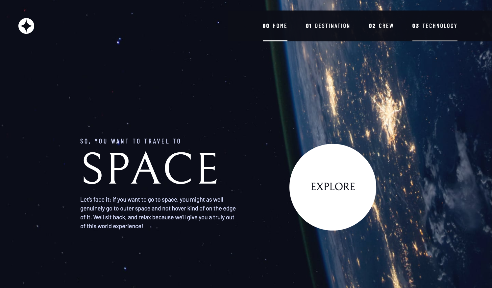
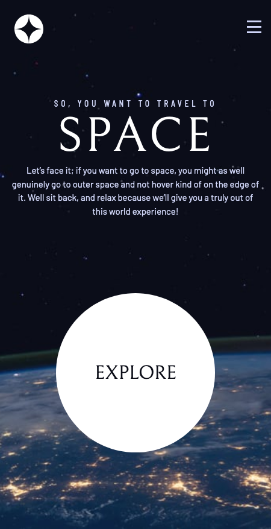

# Frontend Mentor - Space tourism website solution

This is a solution to the [Space tourism website challenge on Frontend Mentor](https://www.frontendmentor.io/challenges/space-tourism-multipage-website-gRWj1URZ3). Frontend Mentor challenges help you improve your coding skills by building realistic projects.

## Table of contents

- [The challenge](#the-challenge)
- [Screenshot](#screenshot)
- [Links](#links)
- [Useful resources](#useful-resources)

### Screenshot

### The challenge

Users should be able to:

- View the optimal layout for each of the website's pages depending on their device's screen size
- See hover states for all interactive elements on the page
- View each page and be able to toggle between the tabs to see new information

### Links

- [GitHub repo](https://github.com/darryncodes/space-tourism-website)
- [Live Site URL](https://darryncodes.github.io/space-tourism-website/)

### Useful resources

- [A Modern CSS Reset](https://piccalil.li/blog/a-modern-css-reset/)
- [Kevin Powell - YouTube channel](https://www.youtube.com/channel/UCJZv4d5rbIKd4QHMPkcABCw)
- [Build a space travel website](https://scrimba.com/learn/spacetravel)
